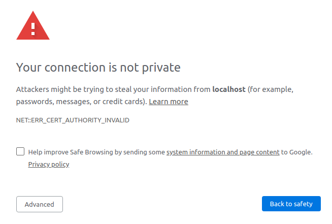

# docker-python-workbox
Docker Ubuntu container with Python 3 (Miniconda).

To build the image:
``` bash
sudo docker build . -t tomtec/python-workbox
```

Run a container with:
``` bash
sudo docker run -it --rm --user pyuser -p 8888:8888 -v /your/shared/directory:/share tomtec/python-workbox
```

Share a directory: to give ownership of the shared volume to user `pyuser` in the
container, you need to do the following on the host machine. Create the directory
to share, then change its ownership using the **numeric** user and group IDs to
match those of the user in the container (which is 10000, as set in the 
`Dockerfile`):
``` bash
mkdir -p /your/shared/directory
sudo chown -R 10000:10000 /your/shared/directory
```

To run a Jupyter notebook inside the container:
``` bash
jupyter notebook --ip=0.0.0.0
```

The notebook can be accessed at https://localhost:8888 (note that it's HTTPS).
Because the certificates aren't produced by a trusted certificate provider known
to the browser, we will see a message like


Click on 'Advanced', then on 'proceed to localhost (unsafe)' to continue (you
only need to do this once).
